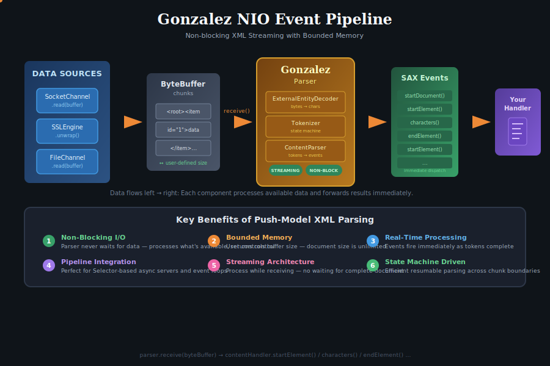

# Gonzalez

Non-blocking streaming XML parser for event-driven I/O

This is Gonzalez, a data-driven XML parser using non-blocking, event-driven I/O.
Unlike traditional SAX parsers that pull data from an InputSource, Gonzalez is
completely feedforward: you push data to it as it arrives, and it produces SAX
events without ever blocking, as long as the documents are standalone.

## Features

- non-blocking: in streaming mode, will only ever block for external
  entities
- data-driven: processes whatever is available, state machine driven
- SAX-compatible: generates standard ContentHandler events and has a SAX2
  convenience front end (which is blocking, of course)
- lazy DTD parsing: DTD parser loaded only when a DOCTYPE is encountered
- memory efficient: streaming architecture handles documents of any size
- Java NIO throughput: uses ByteBuffer for content I/O operations

## Architecture

Traditional SAX parsers use a pull model where the parser controls the flow of
data via InputSource. This requires blocking I/O and makes them incompatible
with asynchronous frameworks. Gonzalez inverts this by using a push model where
data is fed to the parser via `receive(ByteBuffer)`.

The parser is a state machine that processes whatever data is available and
buffers incomplete tokens. When the end of available data is reached, it returns
control to the caller, who can then feed more data when it arrives.  This makes
Gonzalez ideal for integration with async I/O frameworks like the Gumdrop
multiserver.

### NIO Event Pipeline

The following diagram illustrates how Gonzalez integrates into an NIO server
pipeline like Gumdrop or Netty, receiving ByteBuffer chunks from network channels, SSL unwrap operations, or other sources, and transforming XML data in real time into SAX events without blocking or loading the entire document into memory:



### Tokenizer and EED (external entity decoder)

Gonzalez treats the source document being processed itself as an external
entity, as well as external identities that are potentially referenced
inside it. The job of the EED is to convert byte data into character data,
and it will use the XML declaration and text declarations (if any) as well
as BOMs in the byte data to determine the character set decoding process to
be used via NIO.

The tokenizer processes the character data to produce token events using
a state trie to predictably decide on token types and boundaries.
When the tokenizer emits tokens, it passes them to a token consumer via
the latters receive(Token, CharBuffer) interface, so character data
associated with the token is exposed via the NIO CharBuffer interface.

### Content Parser

The content parser is a type of token consumer which handles the main XML
content grammar: elements, attributes, PI, comments etc. It reports events
to the configured SAX ContentHandler.

### DTD Parser

Most XML documents in practice are standalone documents without DTDs. To
minimize memory overhead for the common case, the DTD parser is a separate
component that is loaded only when a DOCTYPE declaration is encountered.

The DTD parser uses the same token consumer interface as the content parser.
It receives DTD content via `receive(Token, CharBuffer)` and reports
declarations through the standard SAX interfaces: DTDHandler for notations
and unparsed entities, DeclHandler for element and attribute declarations,
and LexicalHandler for comments and entity boundaries.

### External Entity Resolution

Gonzalez will use standard SAX2 EntityResolver and EntityResolver2 mechanisms
for resolving external entities in a blocking fashion. Therefore, if you process
XML streams with external entities (including the document type declaration),
this will inevitably affect the performance and reliability of the parsing
process. There is no solution to this: the alternative, using asynchronous
non-blocking I/O, is technically feasible but the parser still needs to block at
the point the external entity is defined until it has been able to finish
parsing it. Therefore all its content input would have to be buffered until the
parser was in a state ready to process it. Since that would easily lead to
resource exhaustion, Gonzalez design is to implement external entities as a
blocking process.

## Usage

```java
Parser parser = new Parser();

// Set handlers
parser.setContentHandler(myContentHandler);

// Set document identifiers (optional, for Locator reporting)
parser.setSystemId("http://example.com/document.xml");
parser.setPublicId("-//Example//DTD Example 1.0//EN");

// Feed data as it arrives. Do this instead of parse() for non-blocking
// behaviour
parser.receive(byteBuffer1);
parser.receive(byteBuffer2);
// ...
parser.close();
// Signal end of document
```

### Document Location Tracking

The parser implements `org.xml.sax.ext.Locator2` to provide accurate position
information during parsing. The locator is automatically passed to the
ContentHandler via `setDocumentLocator()` before `startDocument()` is called.

The locator tracks:
- Line number (starting at 1)
- Column number (starting at 0)
- System identifier (URI)
- Public identifier
- Character encoding
- XML version

Since Gonzalez is data-driven, you must explicitly set the system and
public identifiers if you want them reported:

```java
parser.setSystemId("http://example.com/document.xml");
parser.setPublicId("-//Example//DTD Example 1.0//EN");
```

Line endings are handled according to XML 1.0 specification section 2.11:
- LF (U+000A)
- CR (U+000D)
- CRLF (CR followed by LF, treated as single line ending)

The parser correctly handles CRLF sequences even when split across `receive()`
boundaries.

## Building

Use ant to build the project:

```bash
ant
```

This produces a jar file in the `dist` directory.

The parser has no external dependencies.

## Implementation Status

The architecture has been designed to support the full XML specification,
including:
- XML declaration with all charsets supported by Java
- DOCTYPE with internal and external subsets
- Elements with attributes
- Character data and CDATA sections
- Entity references (character, internal, external)
- Processing instructions
- Comments
- Namespaces
- Validation using DTD
- XML 1.1

## Performance

For small documents (~1KB) Gonzalez outperforms the default (Sun) SAX
implementation in the standard JDK by approximately 4.5 times (i.e. 4.5 times
quicker to parse a document).

For larger documents (~1MB) Gonzalez is around 4 times slower than the
default SAX implementation.

The difficulty with performance on larger documents is inherent to
Gonzalez's non-blocking nature, which allows us to process incoming data
entirely in chunks of any size, producing as many SAX handler events as
can be determined from it at that time, and storing any underflow for
the next chunk. However this design allows Gonzalez to form part of an
overall data pipeline based on asynchronous NIO that can be much more
efficient overall since your thread is never waiting on more data (e.g. from
a network connection).

## Conformance

Gonzalez has been tested with the W3C Conformance test suite xmlconf and
achieves full conformance with that suite.

## Dependencies

Core parser:
- Java 8 or later
- SAX API (org.xml.sax)

## License

Gonzalez is licensed under the GNU Lesser General Public License version 3.
See `COPYING` for full terms.


-- Chris Burdess

