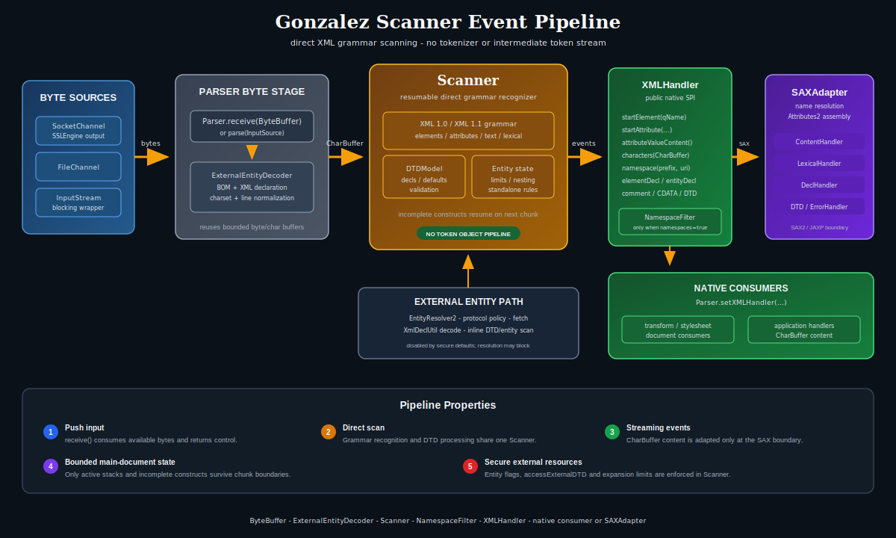

# Gonzalez

Non-blocking streaming XML parser and serializer for event-driven I/O

This is Gonzalez, a data-driven XML parser and serializer using non-blocking,
event-driven I/O. Unlike traditional SAX parsers that pull data from an
InputSource, Gonzalez is completely feedforward: you push data to it as it
arrives, and it produces native or SAX events without ever blocking for I/O,
as long as the documents are standalone. The XMLWriter provides the inverse:
streaming XML serialization to NIO channels.

## Features

### Parser
- non-blocking: in streaming mode, will only ever block for external entities
- data-driven: a resumable Scanner processes whatever character data is
  available directly against the XML grammar
- fully streaming public `XMLHandler` SPI allows attribute values, PI data,
  comments and text of arbitrary size while operating in constant memory
- SAX-compatible: SAXAdapter exposes ContentHandler, LexicalHandler,
  DeclHandler, DTDHandler and Attributes2 events
- JAXP integration: can be used as a drop-in SAX parser via SAXParserFactory
- JPMS module: proper Java module (`org.bluezoo.gonzalez`) for Java 9+
- inline DTD support: Scanner parses internal and external subsets directly
- memory efficient: streaming architecture handles documents of any size
- Java NIO throughput: uses ByteBuffer for content I/O operations

### Serializer (XMLWriter)
- SAX2 native: implements `ContentHandler`, `LexicalHandler`, `DTDHandler`, `DeclHandler`
- NIO-first: writes to `WritableByteChannel` with automatic buffering
- SAX pipeline ready: wire directly as parser event sink, no adapter needed
- namespace-aware: full support for prefixed and default namespaces via `startPrefixMapping`
- DOCTYPE output: supports inline DTD declarations with standalone conversion mode
- pretty-print: optional indentation via `IndentConfig`
- empty element optimization: automatically emits `<foo/>` instead of `<foo></foo>`
- proper escaping: handles special characters in content and attributes
- configurable encoding: UTF-8 (default), ISO-8859-1, US-ASCII, or any Java charset

## Architecture

Traditional SAX parsers use a pull model where the parser controls the flow of
data via InputSource. This requires blocking I/O and makes them incompatible
with asynchronous frameworks. Gonzalez inverts this by using a push model where
data is fed to the parser via `receive(ByteBuffer)`.

The parser is a resumable state machine that processes whatever data is
available and retains only incomplete XML constructs across input boundaries.
When the end of the currently
available data chunk is reached, parsing returns control to the caller, who can feed
more data as and when it arrives. This makes Gonzalez suitable for integration with
async I/O frameworks such as Gumdrop or Netty. Crucially, parsing events are emitted as soon as they can be parsed, meaning that you can process data in your application before having received the entire document and without blocking an entire thread to do it.

### NIO Event Pipeline

The following diagram shows both the byte/character path and the event paths.
ByteBuffer chunks are decoded and normalized, Scanner recognizes XML and DTD
grammar directly, and the resulting `XMLHandler` stream is optionally
namespace-filtered (in `namespaceAware` mode). It then goes either directly to
a native consumer or through `SAXAdapter` to standard SAX2 callbacks:



### Decoder, Scanner, and event adaptation

Gonzalez treats the source document being processed itself as an external
entity, as well as external entities that are potentially referenced
inside it. ExternalEntityDecoder converts incoming document bytes into
characters. It uses the BOM and XML declaration to choose a Java charset,
normalizes XML line endings, and forwards CharBuffer chunks to Scanner.

Scanner processes those characters directly against the XML grammar. It owns
element/entity stacks, DTD declarations and validation state, and preserves
incomplete constructs when a receive boundary falls in the middle of markup.
It emits the streaming `XMLHandler` vocabulary: raw element names, streamed
attribute values and text, namespace declarations, DTD declarations and
lexical boundaries. `XMLHandler` is a public Gonzalez-specific SPI. It avoids
SAX adaptation for native consumers, but is not a standards interface and may
evolve between Gonzalez releases.

When namespace processing is enabled, `NamespaceFilter` translates `xmlns`
attributes into namespace events and can retain the original attributes when
`namespace-prefixes` is enabled. A handler installed with
`Parser.setXMLHandler` consumes this stream directly. On the standard SAX path,
`SAXAdapter` resolves names, assembles the SAX `Attributes2` view, and
dispatches `ContentHandler`, `LexicalHandler`, `DeclHandler`, `DTDHandler` and
`ErrorHandler` callbacks. The native event stream does not construct or expose
intermediate token objects.

### DTD handling

Most XML documents in practice are standalone documents without DTDs. When a
DOCTYPE is present, the Scanner parses the internal and external subsets
inline into its DTDModel. The model supplies attribute defaults and types,
entity declarations, validation content models and ignorable-whitespace
decisions during the same stream. Declarations are exposed through standard
SAX interfaces: DTDHandler for notations and unparsed entities, DeclHandler
for element, attribute and entity declarations, and LexicalHandler for DTD,
comment and entity boundaries.

### External Entity Resolution

Gonzalez will use standard SAX2 EntityResolver and EntityResolver2 mechanisms
for resolving external entities in a blocking fashion. Therefore, if you process
XML streams with external entities (including the document type declaration),
this will inevitably affect the performance and reliability of the parsing
process. There is no solution to this: the alternative, using asynchronous
non-blocking I/O, is technically feasible but the parser still needs to block at
the point the external entity is defined until it has been able to finish
parsing it. Therefore all its content input would have to be buffered until the
parser was in a state ready to process it. Since that would easily lead to
resource exhaustion, Gonzalez design is to implement external entities as a
blocking process.

## XSLT Transformer

Gonzalez includes an XSLT 3.0 transformer that follows the same design
principles as the parser: event-driven processing with predictable resource
usage. The transformer integrates with standard JAXP APIs
(`TransformerFactory`, `Templates`, `Transformer`) and can be used as a
drop-in replacement for other XSLT processors.

Key features:
- **JAXP compliant** - Standard `TransformerFactory` interface
- **Streaming support** - Native `XMLHandler` ingest for Gonzalez-owned parses,
  with SAX retained at JAXP and foreign-parser boundaries
- **Iterative XPath parser** - Pratt algorithm with explicit stacks, no
  recursion
- **Forward-compatible** - Graceful handling of later XSLT version
  constructs

See **[XSLT.md](XSLT.md)** for detailed documentation on the transformer design,
features, test methodology, and performance characteristics.

## Documentation

- [Javadoc package and class documentation](https://cpkb-bluezoo.github.io/gonzalez/doc/)
- [XSLT Transformer Documentation](XSLT.md)

## Usage

```java
Parser parser = new Parser();

// Set handlers
parser.setContentHandler(myContentHandler);

// Set document identifiers (optional, for Locator reporting)
parser.setSystemId("http://example.com/document.xml");
parser.setPublicId("-//Example//DTD Example 1.0//EN");

// Feed data as it arrives. Do this instead of parse() for non-blocking
// behaviour
parser.receive(byteBuffer1);
parser.receive(byteBuffer2);
// ...
parser.close();
// Signal end of document
```

### Native XMLHandler Usage

Native consumers can bypass `SAXAdapter` and receive the Scanner's streaming
event vocabulary directly:

```java
Parser parser = new Parser();
XMLHandler nativeHandler = createNativeHandler();
parser.setXMLHandler(nativeHandler);

parser.receive(byteBuffer1);
parser.receive(byteBuffer2);
parser.close();
```

Set the handler before parsing starts. When non-null, it receives content,
lexical, declaration, DTD and error events instead of the configured SAX
handlers. Namespace events pass through `NamespaceFilter` when namespace
processing is enabled. The setting survives `Parser.reset()`; pass `null`
before the next parse to restore the SAX path.

`XMLHandler` is intended for Gonzalez modules and tightly integrated
applications that benefit from streamed `CharBuffer` content and attributes.
It is a Gonzalez-specific evolving SPI, not a compatibility substitute for
SAX. Use SAX/JAXP interfaces when a stable standards boundary is required.

### JAXP Usage

Gonzalez can also be used via the standard JAXP SAXParserFactory mechanism,
making it a drop-in replacement for other SAX parsers:

```java
// Explicit factory selection
SAXParserFactory factory = SAXParserFactory.newInstance(
    "org.bluezoo.gonzalez.GonzalezSAXParserFactory", null);
factory.setNamespaceAware(true);

SAXParser parser = factory.newSAXParser();
parser.parse(inputStream, myHandler);
```

Or set Gonzalez as the default SAX parser via system property:

```java
System.setProperty("javax.xml.parsers.SAXParserFactory",
    "org.bluezoo.gonzalez.GonzalezSAXParserFactory");

SAXParserFactory factory = SAXParserFactory.newInstance();
SAXParser parser = factory.newSAXParser();
parser.parse(inputStream, myHandler);
```

### Document Location Tracking

The parser implements `org.xml.sax.ext.Locator2`. The locator is automatically
passed to the ContentHandler via `setDocumentLocator()` before
`startDocument()` is called.

The locator reports:
- System identifier (URI)
- Public identifier
- Character encoding
- XML version

Line and column positions are not currently tracked and are reported as `-1`.
Set the system and public identifiers explicitly if you want them reported:

```java
parser.setSystemId("http://example.com/document.xml");
parser.setPublicId("-//Example//DTD Example 1.0//EN");
```

Line endings are handled according to XML 1.0 specification section 2.11:
- LF (U+000A)
- CR (U+000D)
- CRLF (CR followed by LF, treated as single line ending)

The parser correctly handles CRLF sequences even when split across `receive()`
boundaries.

XML 1.1 line-end delimiters are also supported in XML 1.1 documents.

### XMLWriter Usage

The XMLWriter implements SAX2 interfaces directly, so it can be wired into a
SAX pipeline as an event sink with no adapter:

```java
import org.bluezoo.gonzalez.Parser;
import org.bluezoo.gonzalez.XMLWriter;

// Parse and serialize: wire parser directly to writer
Parser parser = new Parser();
FileChannel channel = FileChannel.open(path, WRITE, CREATE);
XMLWriter writer = new XMLWriter(channel);
writer.setIndentConfig(IndentConfig.spaces2());

parser.setContentHandler(writer);
parser.setProperty("http://xml.org/sax/properties/lexical-handler", writer);
parser.parse(inputSource);
writer.close();
```

For standalone use, call SAX methods directly:

```java
import org.bluezoo.gonzalez.XMLWriter;
import org.xml.sax.helpers.AttributesImpl;

try (FileOutputStream fos = new FileOutputStream("output.xml")) {
    XMLWriter writer = new XMLWriter(fos);
    writer.setIndentConfig(IndentConfig.spaces2());

    AttributesImpl atts = new AttributesImpl();
    atts.addAttribute("", "version", "version", "CDATA", "1.0");

    writer.startDocument();
    writer.startPrefixMapping("", "http://example.com/ns");
    writer.startElement("http://example.com/ns", "root", "root", atts);

    AttributesImpl itemAtts = new AttributesImpl();
    itemAtts.addAttribute("", "id", "id", "CDATA", "1");
    writer.startElement("http://example.com/ns", "item", "item", itemAtts);
    char[] text = "Hello, World!".toCharArray();
    writer.characters(text, 0, text.length);
    writer.endElement("http://example.com/ns", "item", "item");

    writer.startElement("http://example.com/ns", "empty", "empty", new AttributesImpl());
    writer.endElement("http://example.com/ns", "empty", "empty");

    writer.endElement("http://example.com/ns", "root", "root");
    writer.endPrefixMapping("");
    writer.endDocument();
    writer.close();
}
```

Output:
```xml
<root xmlns="http://example.com/ns" version="1.0">
  <item id="1">Hello, World!</item>
  <empty/>
</root>
```

## Security

Gonzalez is **secure by default**. External entity processing and external DTD
loading are disabled out of the box, protecting against XXE (XML External
Entity) attacks, SSRF, and entity expansion bombs.

### Default Security Settings

| Setting | Default | Effect |
|---------|---------|--------|
| `external-general-entities` | `false` | External general entities are not resolved |
| `external-parameter-entities` | `false` | External DTD subsets are not loaded |
| `accessExternalDTD` | `""` (none) | No protocols allowed for external DTD access |
| Entity expansion limit | 64,000 | Protects against billion-laughs entity bombs |

### Enabling External Entities

If you need to process documents with external DTDs or entity references, you
must explicitly opt in to both the feature flags **and** the allowed protocols:

```java
Parser parser = new Parser();

// Enable external entity processing
parser.setFeature("http://xml.org/sax/features/external-general-entities", true);
parser.setFeature("http://xml.org/sax/features/external-parameter-entities", true);

// Allow specific protocols (required even when entities are enabled)
parser.setProperty("http://javax.xml.XMLConstants/property/accessExternalDTD", "file");
```

The `accessExternalDTD` property accepts:
- `""` -- no protocols allowed (default)
- `"all"` -- all protocols allowed
- Comma-separated list -- e.g. `"file"`, `"file,http,https"`

### JAXP Secure Processing

Gonzalez recognizes the standard JAXP `FEATURE_SECURE_PROCESSING` feature.
Setting it to `false` enables external entities and sets `accessExternalDTD`
to `"all"`:

```java
// Via SAXParserFactory
SAXParserFactory factory = new GonzalezSAXParserFactory();
factory.setFeature("http://javax.xml.XMLConstants/feature/secure-processing", false);
SAXParser parser = factory.newSAXParser();
```

### XSLT Transformer Security

The transformer factory also enforces secure defaults. To allow stylesheet
and DTD loading from files:

```java
GonzalezTransformerFactory factory = new GonzalezTransformerFactory();
factory.setAttribute("http://javax.xml.XMLConstants/property/accessExternalStylesheet", "file");
factory.setAttribute("http://javax.xml.XMLConstants/property/accessExternalDTD", "file");
```

### Entity Expansion Limit

The default limit of 64,000 entity expansions matches the JDK default and
protects against entity expansion attacks (billion laughs). To adjust:

```java
parser.setProperty("http://www.nongnu.org/gonzalez/properties/entity-expansion-limit", 100000);
```

Set to `0` to disable the limit (not recommended for untrusted input).

## Building

Use ant to build the project:

```bash
ant dist
```

This produces three jar files in the `dist` directory:

| JAR | Contents | Dependencies |
|-----|----------|--------------|
| `gonzalez-core-1.2.0.jar` | Scanner-based parser and XMLWriter | None |
| `gonzalez-xslt-1.2.0.jar` | XSLT transformer, schema (~1.7 MB) | gonzalez-core, jsonparser |
| `gonzalez-1.2.0.jar` | Combined (fat jar) (~1.9 MB) | jsonparser |

**When to use which:**
- **Core only** — Use `gonzalez-core` if you only need XML parsing/serialization (e.g. Gumdrop, Netty pipelines). Zero external dependencies.
- **XSLT** — Use `gonzalez-xslt` (plus `gonzalez-core` and jsonparser) for XSLT transformation.
- **Fat jar** — Use `gonzalez-1.2.0.jar` for backward compatibility or when you want everything in one artifact.

**Download from GitHub Releases:**
- [gonzalez-core-1.2.0.jar](https://github.com/cpkb-bluezoo/gonzalez/releases/download/v1.2.0/gonzalez-core-1.2.0.jar)
- [gonzalez-xslt-1.2.0.jar](https://github.com/cpkb-bluezoo/gonzalez/releases/download/v1.2.0/gonzalez-xslt-1.2.0.jar)
- [gonzalez-1.2.0.jar](https://github.com/cpkb-bluezoo/gonzalez/releases/download/v1.2.0/gonzalez-1.2.0.jar)

The build downloads the jsonparser library automatically (see Dependencies below).

## Implementation Status

Gonzalez supports the entire XML specification:
- XML declaration with all charsets supported by Java
- DOCTYPE with internal and external subsets
- Elements with attributes
- Character data and CDATA sections
- Entity references (character, internal, external)
- Processing instructions
- Comments
- XML Namespaces
- Validation using DTD
- XML 1.1

## Performance

The current XML parser implementation was compared with the SAX parser bundled
with JDK 21 (Xerces) and
[aalto-xml](https://github.com/FasterXML/aalto-xml) 1.4.1-SNAPSHOT. All paths
ran namespace-aware with an empty handler. The raw Gonzalez path is
`ExternalEntityDecoder → Scanner → NamespaceFilter → XMLHandler`; it bypasses
`SAXAdapter` while still performing byte decoding, XML grammar processing, DTD
work and namespace declaration handling. Gonzalez SAX adds name resolution,
`Attributes2` assembly and standard SAX callback adaptation. The
`XMLHandler` column measures the public native SPI path; unlike SAX, that SPI
is Gonzalez-specific and may evolve between releases.

Aalto's lower-level StAX cursor is included as an additional reference point,
but is not directly equivalent to SAX callback delivery.

The figures below are median throughput across five fresh JVM runs. Each run
used 20 warm-up parses followed by 30 measured parses. The original five
documents are in `benchmark/resources`; `BenchmarkCorpora` deterministically
generates three additional substantial documents:

- the same 4,000-article Japanese document encoded as BOM-marked UTF-16LE and
  EUC-JP, isolating the two decoder paths as far as practical;
- a 1,500-article XHTML-shaped document with a self-contained internal subset
  declaring 33 elements, common and element-specific attributes, content
  models, and character entities. It has no public or system identifier, so
  no external subset is fetched.

**Aalto is not a validating or DTD-processing parser.** Its SAX factory rejects
validating mode, and its own `Attributes2` implementation states that DTD
processing is absent. For the XHTML corpus, Aalto recognizes the DOCTYPE and
emits `startDTD`/`endDTD`, but skips the internal declarations: it does not
apply declared attribute types or defaults and cannot expand the declared
general entities. Gonzalez and JDK Xerces parse and apply those declarations.
The XHTML row is therefore included to expose this capability and cost
difference, not as a like-for-like throughput comparison.

| Corpus | Size | Gonzalez XMLHandler | Gonzalez SAX | JDK Xerces SAX | Aalto SAX | Aalto StAX cursor |
|--------|-----:|--------------------:|-------------:|----------------:|----------:|------------------:|
| Plain UTF-8 | 1.02 MiB | **864 MB/s** | 550 MB/s | 507 MB/s | 1,124 MB/s | 1,197 MB/s |
| Attribute-heavy UTF-8 | 1.28 MiB | **501 MB/s** | 337 MB/s | 247 MB/s | 955 MB/s | 957 MB/s |
| Whitespace-heavy UTF-8 | 0.94 MiB | **1,028 MB/s** | 779 MB/s | 647 MB/s | 1,294 MB/s | 1,528 MB/s |
| Markup-heavy UTF-8 | 0.96 MiB | **688 MB/s** | 565 MB/s | 364 MB/s | 1,337 MB/s | 1,577 MB/s |
| Multibyte UTF-8 | 0.49 MiB | **496 MB/s** | 310 MB/s | 307 MB/s | 702 MB/s | 775 MB/s |
| Japanese UTF-16LE | 1.50 MiB | **715 MB/s** | 557 MB/s | 753 MB/s | 879 MB/s | 841 MB/s |
| Japanese EUC-JP | 1.28 MiB | **554 MB/s** | 428 MB/s | 416 MB/s | 630 MB/s | 608 MB/s |
| XHTML internal DTD (not equivalent; see above) | 1.19 MiB | **305 MB/s** | 235 MB/s | 131 MB/s | 716 MB/s | 735 MB/s |

The non-UTF results differ materially from the original UTF-8 cases. JDK
Xerces SAX is about 35% faster than Gonzalez SAX on UTF-16LE, while Gonzalez
SAX is about 3% faster on EUC-JP. Aalto SAX is roughly 1.6 and 1.5 times as
fast as Gonzalez SAX on those two encoding cases. Throughput is measured from
encoded byte size, so UTF-16's MB/s also reflects that it uses more bytes for
the same logical Japanese document.

The DTD behavior was verified from SAX events using
`benchmark/external-compare/DtdProbe.java`: Gonzalez and JDK Xerces report
`id` attributes with declared type `ID` and inject the DTD-defaulted,
non-specified `type="text"` attribute on `<input>`. Aalto reports `id` as
`CDATA` and omits the defaulted attribute. Its higher number on this row must
not be interpreted as faster DTD processing, because it does not perform that
processing.

These are microbenchmarks, not application-level latency guarantees. Results
depend on the JDK, hardware, handlers and document shape. Gonzalez's primary
architectural advantages remain:

- **Non-blocking document input**: `receive(ByteBuffer)` processes available
  network data without dedicating a thread to wait for the rest of the
  document. External entity resolution may still block when explicitly
  enabled.
- **Streaming memory use**: main-document bytes and character data are
  processed in reusable chunks rather than loading the whole document.

Run `benchmark/external-compare/run.sh` from the repository root to reproduce
the comparison using a local aalto-xml checkout.

## Conformance

Gonzalez has been tested with the W3C Conformance test suite xmlconf and
achieves 100% conformance with that suite. The test data in `xmlconf/` is from
the [20130923 release](https://www.w3.org/XML/Test/), the latest and final
official release.

## Dependencies

- Java 8 or later (including SAX API)
- **gonzalez-core** — Zero external dependencies.
- **gonzalez-xslt** — Requires `gonzalez-core` and [**jsonparser**](https://github.com/cpkb-bluezoo/jsonparser) (org.bluezoo.json). The jsonparser
  library is used for XML-to-JSON and JSON-to-XML translation (`xml-to-json`, `json-to-xml`,
  `parse-json`). The build downloads the jsonparser jar from [GitHub Releases](https://github.com/cpkb-bluezoo/jsonparser/releases)
  via the `resolve-deps` target.

For Java 9+, Gonzalez provides JPMS modules:

```java
// Parser/writer only (zero dependencies)
module myapp {
    requires org.bluezoo.gonzalez;
}

// XSLT support (requires core + jsonparser)
module myapp {
    requires org.bluezoo.gonzalez;
    requires org.bluezoo.gonzalez.xslt;
    requires org.bluezoo.json;
}
```

## License

Gonzalez is licensed under the GNU Lesser General Public License version 3.
See `COPYING` for full terms.


-- Chris Burdess

