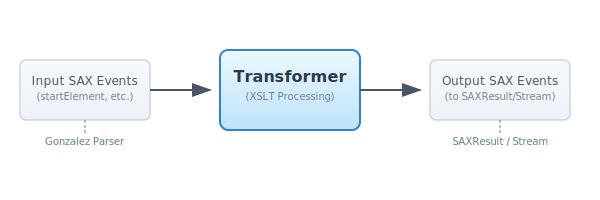
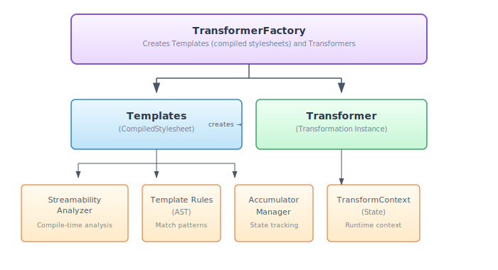
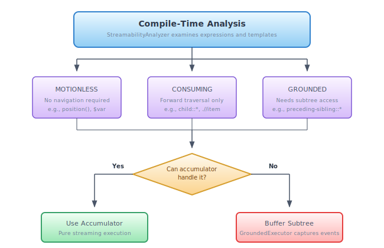

# Gonzalez XSLT Transformer

Streaming XSLT transformation facility with XSLT 3.0 streaming support

## Overview

The Gonzalez XSLT transformer provides streaming transformation capabilities that
align with Gonzalez's core design principles: event-driven processing, predictable
resource usage, and JAXP compliance. Unlike traditional XSLT processors that build
complete in-memory DOM trees, Gonzalez uses an accumulator-based streaming
architecture that enables processing of arbitrarily large documents.

The transformer supports XSLT 1.0, 2.0, and 3.0 stylesheets with a focus on
streaming execution. XSLT 3.0's explicit streaming constructs (`xsl:stream`,
`xsl:accumulator`, `xsl:iterate`) are supported, and XSLT 1.0/2.0
stylesheets are automatically analyzed for streamability.

## Conformance

Current pass rates against the W3C XSLT 3.0 Conformance Test Suite:

| Version | Tests | Passed | Rate |
|---------|-------|--------|------|
| XSLT 1.0 | 2,023 | 2,023 | 100.0% |
| XSLT 2.0 | 4,729 | 4,018 | 85.0% |
| XSLT 3.0 | 9,353 | 7,074 | 75.6% |

## Error Handling

Gonzalez implements comprehensive error handling with three modes:

### Error Handling Modes

- **STRICT** (default) - Spec-compliant fail-fast behavior. Type errors (XTTE*) cause immediate transformation failure.
- **RECOVER** - Error recovery with warnings. Type errors are logged to stderr, transformation continues.
- **SILENT** - Maximum compatibility. Type checking disabled entirely (XSLT 1.0-like behavior).

## Design Goals

1. **Streaming-First** - Process documents larger than available memory
2. **JAXP Compliance** - Drop-in replacement via `TransformerFactory`
3. **Event-Driven** - SAX-based input and output
4. **Accumulator-Based** - XSLT 3.0 accumulators as the primary stateful mechanism
5. **Automatic Streamability** - Analyze XSLT 1.0/2.0 stylesheets for streaming execution
6. **Full XPath Support** - XPath 1.0 through 3.1 including maps, arrays, and higher-order functions
7. **Predictable Resources** - Iterative algorithms, explicit state management

## Architecture

### SAX Event Filter Model

The transformer operates as a **SAX event filter**: it receives input SAX events
from the source document, applies XSLT transformations, and emits output SAX
events to the result. This design enables:

- Direct integration with Gonzalez's streaming parser
- Pipeline composition with other SAX filters
- Memory-efficient processing of large documents
- Native SAX-to-SAX transformation path



### Component Overview



### Streaming Architecture

The transformer uses a three-tier buffering strategy:

| Strategy | Description | Use Case |
|----------|-------------|----------|
| NONE | Pure streaming with accumulators | Forward-only access |
| GROUNDED | Subtree buffering | Reverse axes within element |
| FULL_DOCUMENT | Complete document buffering | Global reverse access |

**Streaming Decision Flow:**



### Accumulators

Accumulators are the primary mechanism for maintaining state during streaming.
They accumulate values as nodes are processed, eliminating the need to buffer
the document.

**Explicit Accumulators (XSLT 3.0):**

```xml
<xsl:accumulator name="line-count" initial-value="0" as="xs:integer">
  <xsl:accumulator-rule match="line" select="$value + 1"/>
</xsl:accumulator>

<!-- Access in templates -->
<xsl:value-of select="accumulator-after('line-count')"/>
```

**Internal Accumulators (Automatic):**

For XSLT 1.0/2.0 stylesheets, the `InternalAccumulatorFactory` automatically
creates synthetic accumulators for common patterns:

| Pattern | Internal Accumulator |
|---------|---------------------|
| `position()` | Counter accumulator |
| `count(preceding-sibling::*)` | Sibling counter |
| `sum(preceding-sibling::@value)` | Running sum |

This allows stylesheets written for XSLT 1.0 to execute in streaming mode
without modification.

### Stylesheet Compilation

Stylesheets are compiled using SAX events from the Gonzalez XML parser:

1. **StylesheetCompiler** - SAX ContentHandler that builds the compiled representation
2. **StreamabilityAnalyzer** - Analyzes templates for streaming capability
3. **InternalAccumulatorFactory** - Creates synthetic accumulators for 1.0/2.0 patterns
4. **CompiledStylesheet** - Immutable representation containing:
   - Template rules with match patterns
   - Named templates
   - Accumulator definitions
   - Mode declarations
   - Global variables and parameters
   - Attribute sets
   - Key definitions
   - Output properties

### XPath Engine

The XPath engine implements XPath 1.0, 2.0, 3.0, and 3.1:

- **XPathLexer** - Tokenizes XPath expressions (including 3.1 syntax)
- **XPathParser** - Pratt (operator precedence) parser using iterative algorithm
- **Expression AST** - `Expr` interface with implementations for all XPath constructs
- **Axis Iterators** - Lazy evaluation of XPath axes over node sets
- **Function Libraries** - Core XPath 1.0, XSLT 2.0/3.0, math, map, and array functions
- **Type System** - XPath 2.0+ sequences, atomic values, maps, arrays, function items

#### XPath Type System

| Type | Description | Version |
|------|-------------|---------|
| String | Unicode character sequence | 1.0 |
| Number | IEEE 754 double | 1.0 |
| Boolean | True/false | 1.0 |
| NodeSet | Unordered collection of nodes | 1.0 |
| Sequence | Ordered collection of items | 2.0+ |
| Atomic | Untyped atomic value | 2.0+ |
| Map | Immutable key-value map (`map{key:value}`) | 3.1 |
| Array | Ordered collection of members (`[item, ...]`, `array{...}`) | 3.1 |
| Function | Function item (named refs, inline, partial application) | 3.0+ |

#### XPath 2.0/3.1 Feature Support

The XPath engine supports XPath 1.0, 2.0, 3.0, and 3.1 including higher-order
functions, maps, arrays, and dynamic function calls.

**Higher-Order Functions (XPath 3.0+):**

| Feature | Status |
|---------|--------|
| `fn:for-each($seq, $f)` | Supported |
| `fn:filter($seq, $f)` | Supported |
| `fn:fold-left($seq, $zero, $f)` | Supported |
| `fn:fold-right($seq, $zero, $f)` | Supported |
| `fn:for-each-pair($seq1, $seq2, $f)` | Supported |
| `fn:sort($seq, $collation, $key)` | Supported |
| Inline functions `function($x) { body }` | Supported |
| Named function references `name#arity` | Supported (including user functions) |
| Partial application `func(?, bound)` | Supported |
| Dynamic function calls `$f(args)` | Supported |
| Arrow operator `$x => fn:upper-case()` | Supported (function call form) |

**Maps (XPath 3.1):**

| Feature | Status |
|---------|--------|
| Map constructor `map{key: value}` | Supported |
| `xsl:map` / `xsl:map-entry` instructions | Supported |
| Lookup `$map?key`, `$map?*` | Supported |
| `map:size`, `map:keys`, `map:contains`, `map:get` | Supported |
| `map:put`, `map:remove`, `map:entry`, `map:merge` | Supported |
| `map:find` | Supported |
| `map:for-each` | Supported |

**Arrays (XPath 3.1):**

| Feature | Status |
|---------|--------|
| Bracket constructor `[expr, ...]` | Supported |
| Accolade constructor `array{expr}` | Supported |
| Lookup `$array?1`, `$array?*` | Supported |
| `array:size`, `array:get`, `array:put`, `array:append` | Supported |
| `array:subarray`, `array:remove`, `array:insert-before` | Supported |
| `array:head`, `array:tail`, `array:reverse`, `array:join` | Supported |
| `array:flatten`, `array:sort` | Supported |
| `array:for-each`, `array:filter`, `array:fold-left/right` | Supported |
| `array:for-each-pair` | Supported |

**Schema Awareness:**

Gonzalez is a **Basic XSLT processor** (non-schema-aware). `xsl:import-schema`
parses schemas for type tests and substitution groups, but input documents are
not validated against imported schemas. `validation="strict"` raises XTSE1660;
`validation="lax"` and `validation="preserve"` are treated as `strip`.

#### Iterative Parser Design

The XPath parser uses explicit stacks instead of recursion, consistent with
Gonzalez's state-machine design philosophy. This provides:

- **Predictable stack usage** - No risk of stack overflow on deeply nested expressions
- **Explicit state management** - Parser state is fully visible and debuggable
- **Context isolation** - Nested expression parsing uses separate contexts

### XPath Axis Streaming

XPath axes are classified by their streaming characteristics:

| Axis Type | Axes | Streaming |
|-----------|------|-----------|
| Forward | child, descendant, following, following-sibling, attribute, namespace, self, descendant-or-self | Can stream |
| Reverse | parent, ancestor, preceding, preceding-sibling, ancestor-or-self | Require buffering |

### Dual-Mode Node Representation

Since Gonzalez is event-driven, nodes have two representations:

- **StreamingNode** - Lightweight wrapper during streaming (forward-only)
- **BufferedNode** - Full XPath node interface over captured SAX events

The `GroundedExecutor` manages transitions between modes, buffering subtrees
only when required for reverse axis navigation.

### Runtime Execution

Transformation execution uses:

- **TransformContext** - Maintains transformation state (current node, variables, etc.)
- **AccumulatorManager** - Manages all accumulator state during streaming
- **StreamingContext** - Context for `xsl:stream` execution
- **TemplateMatcher** - Selects best matching template rule for a node
- **OutputHandler** - Receives transformation output (SAX events or stream)
- **VariableScope** - Manages variable bindings with proper scoping
- **SAXEventBuffer** - Captures and replays SAX event subtrees when buffering is needed

## JAXP Integration

The transformer integrates with standard JAXP APIs:

```java
// Create factory
TransformerFactory factory = TransformerFactory.newInstance(
    "org.bluezoo.gonzalez.transform.GonzalezTransformerFactory", null);

// Compile stylesheet (reusable)
Templates templates = factory.newTemplates(new StreamSource("style.xsl"));

// Create transformer instance
Transformer transformer = templates.newTransformer();

// Transform (blocks reading from input)
transformer.transform(
    new StreamSource(inputStream),
    new StreamResult(outputStream));
```

### SAX Pipeline Integration

The `TransformerHandler` accepts SAX events on its input side (implementing
`ContentHandler`) and sends transformed events to a `Result` on the output
side. For a true SAX pipeline where the next stage is another
`ContentHandler`, use a `SAXResult`:

```java
// SAX pipeline: parser -> XSLT transform -> downstream handler
SAXTransformerFactory stf = (SAXTransformerFactory) factory;
TransformerHandler handler = stf.newTransformerHandler(templates);
handler.setResult(new SAXResult(downstreamHandler));

// Feed SAX events from Gonzalez parser (non-blocking, as data arrives)
parser.setContentHandler(handler);
parser.receive(buffer1);
parser.receive(buffer2);
parser.close();
```

When the transformer is the final stage, a `StreamResult` serializes to
an output stream:

```java
TransformerHandler handler = stf.newTransformerHandler(templates);
handler.setResult(new StreamResult(outputStream));

parser.setContentHandler(handler);
parser.parse(inputSource);
```

## Features

All XSLT 1.0, 2.0 and 3.0 element types are supported.

### Forward-Compatible Processing

When a stylesheet declares `version="2.0"` or higher, the processor:

1. Ignores unrecognized XSLT elements (executes `xsl:fallback` if present)
2. Parses XPath 2.0 syntax (with XPath 1.0 semantics where possible)
3. Continues processing rather than failing on unknown constructs

## Streamability Analysis

The `StreamabilityAnalyzer` classifies expressions and templates at compile time:

### Expression Streamability

| Classification | Description | Example |
|----------------|-------------|---------|
| MOTIONLESS | No navigation, same result anywhere | `$var`, `"text"`, `3.14` |
| CONSUMING | Forward traversal | `child::*`, `.//item` |
| GROUNDED | Needs subtree but not document | `preceding-sibling::*` within element |
| FREE_RANGING | Needs full document | `//item`, `preceding::*` |

### Automatic Streaming for XSLT 1.0/2.0

The transformer analyzes XSLT 1.0/2.0 stylesheets and creates internal
accumulators for patterns that can be streamed:

```xml
<!-- Original XSLT 1.0 -->
<xsl:template match="item">
  <item position="{position()}">
    <count><xsl:value-of select="count(preceding-sibling::item)"/></count>
  </item>
</xsl:template>

<!-- Automatically converted to use internal accumulators -->
<!-- position() → counter accumulator -->
<!-- count(preceding-sibling::item) → sibling counter accumulator -->
```

This allows existing stylesheets to benefit from streaming without modification.

## Test Methodology

### Conformance Testing

The transformer is tested against the **W3C XSLT 3.0 Conformance Test Suite**
and optionally the **W3C XPath/XQuery 3.1 Test Suite**, filtered for
non-schema-aware tests. The test suites include:

- XSLT 1.0, 2.0, and 3.0 tests
- XPath 2.0 and 3.1 expression tests
- Tests from multiple sources (W3C, OASIS, vendor contributions)

### Extracting Tests

Before running conformance tests, extract them from the W3C repositories:

```bash
# Clone the test suites (one-time setup)
git clone https://github.com/w3c/xslt30-test ../xslt30-test
git clone https://github.com/w3c/qt3tests ../qt3tests

# Run the tests
./test-all-xslt.sh

# View results
cat test/output/xslt-conformance-report.txt
```

## Performance

### Design Considerations

The transformer is designed for:

1. **Streaming by default** - Accumulators handle state without buffering
2. **Lazy evaluation** - XPath node sets are evaluated lazily
3. **Compiled patterns** - Match patterns are pre-compiled for efficient matching
4. **Pooled objects** - Reuse of QName and other frequently-allocated objects

### Memory Characteristics

- **Compiled stylesheet** - Immutable, can be shared across threads
- **Transformation context** - Per-transformation state, not thread-safe
- **Accumulator state** - O(depth) stack for accumulator values
- **Node representation** - Lightweight wrappers over SAX events where possible

### Benchmarking

Benchmark infrastructure is available in the `benchmark/` directory. Key metrics:

- Stylesheet compilation time
- Transformation throughput (documents/second)
- Memory usage during transformation
- Streaming efficiency (bytes buffered vs document size)

## Extension Mechanisms

### Extension Functions

Custom XPath functions can be registered:

```java
ExtensionRegistry registry = new ExtensionRegistry();
registry.registerFunction("http://example.com/fn", "myFunc", 
    new MyExtensionFunction());
```

### Extension Elements

Custom XSLT elements (planned):

```java
registry.registerElement("http://example.com/xsl", "custom",
    new MyExtensionElement());
```

## Limitations By Design

1. **No DOM output** - Gonzalez focuses on streaming; use SAX result
2. **External entity blocking** - Same limitation as Gonzalez parser
3. **No Reader/character stream input** - Gonzalez requires byte streams for 
   encoding detection (BOM, XML declaration). Use `InputStream` or system ID instead of `Reader`
4. **Basic XSLT processor** - Not schema-aware; no PSVI on nodes, no input
   document validation against imported schemas

## Related Documentation

- [Gonzalez README](README.md) - Main project documentation
- [Javadoc](https://cpkb-bluezoo.github.io/gonzalez/doc/) - API documentation
- [XSLT 1.0 Specification](https://www.w3.org/TR/xslt) - W3C XSLT 1.0 specification
- [XSLT 3.0 Specification](https://www.w3.org/TR/xslt-30/) - W3C XSLT 3.0 specification
- [XPath 1.0 Specification](https://www.w3.org/TR/xpath/) - W3C XPath 1.0 specification
- [XPath 3.1 Specification](https://www.w3.org/TR/xpath-31/) - W3C XPath 3.1 specification
